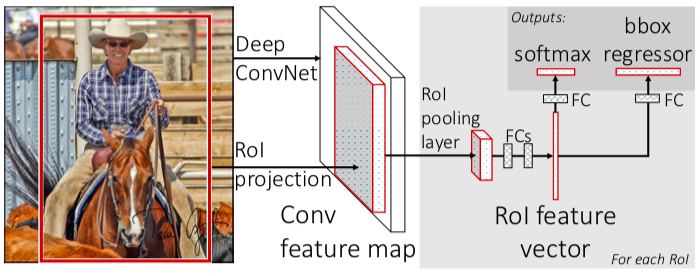

These notes describe the R-CNN model for object detection. These are my notes from many online sources, referenced at the bottom. Thank you to their authors for their awesome explanations!

# Fast R-CNN
Fast R-CNN improves over its predecessor, R-CNN, in both training and inference speed by creating a end-to-end model which can be trained with back-propagation.

__Task__: Locate objects in an image (object detection)

__Problems with R-CNN__:
1. __Slow__: You had to calculate a feature vector for each of the proposal regions (2000).
2. __Hard to train__: R-CNN had three parts (CNN, SVM, Boudning Box Regressor, though this was optional), making training difficult.
3 __Large memory requirement__: You had to save the feature vector (4096-dim) for every region proposal. This takes a lot of memory.
4. __Selective search algorithm doesn't learn anyhting__: It's a fixed algorithm, so it can't learn and improve the model.

## Enter Fast R-CNN
To make it run faster, the author combined all three parts into one architecture, which can be trained end-to-end. 

1. Turn the whole image into a feature map, using a CNN.
2. For each region proposal, identify the corresponding region of the feature map, warp them into squares using an RoI pooling layer (Region of Interest).
3. Flatten this fixed-size _region proposal feature map_. Now it's a feature vector, with fixed size.
4. Feed the RoI feature vector into a fully connect neural network that has two outputs:
  1. __Softmax classification__, to decide which object class we found.
  2. __Bounding Box Regressor__, which oututs the bouding box coordinates for each object class.
  
  
  
## Results
The Fast C-NN trains the VGG16 network 9 times faster than R-CNN. And the inference is 213 faster and achieves a higher mAP!

## Reason
The Fast R-CNN is faster than R-CNN because you don't have to feed in the 2000 region proposals to the CNN every time. Instead, the single image is feed into the CNN, only once image.

## Summary
The important thing is that Fast R-CNN is one end-to-end system that we can train with back-propagation. And training and inference are much faster than R-CNN.

## References
* [Part 2: Fast R-CNN](https://towardsdatascience.com/part-2-fast-r-cnn-object-detection-7303e1988464)
* [R-CNN, Fast R-CNN, Faster R-CNN, YOLO — Object Detection Algorithms](https://towardsdatascience.com/r-cnn-fast-r-cnn-faster-r-cnn-yolo-object-detection-algorithms-36d53571365e)
* __Fast R-CNN paper__: Fast R-CNN ([https://arxiv.org/pdf/1504.08083.pdf](https://arxiv.org/pdf/1504.08083.pdf))