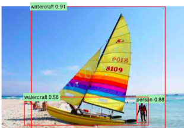

These notes describe the R-CNN model for object detection. These are my notes from many online sources, referenced at the bottom. Thank you to their authors for their awesome explanations!

# Faster R-CNN
Faster R-CNN improves over its predecessor, Fast R-CNN, in both training and inference speed by creating a end-to-end model which can be trained with back-propagation.

__Task__: Locate objects in an image (object detection)

__Problem with Fast R-CNN__:
* Selective search for finding the proposal regions is slow. So the author designed an object detection algorithm to eliminate selective search and allow the network to learn the region proposals.

## Enter Faster R-CNN
Similar to Fast R-CNN:
1. The image is feed into a CNN and outputs a convolutional feature map.

Different:  

2. Instead of using the select search on the feature map to identify the region proposals, a separate network is used to predict the region proposals.
3. Prediction region proposals are reshaped using an RoI pooling layer.
4. Then fed into a classifier to classify the image within the proposed region and predict the offset values for the bouding boxes (same as Fast R-CNN).

## YOLO - You Only Look Once
All of the R-CNN algorithms use regions to localize the object within the image. The network does not look at the complete image. The YOLO algorithm is much different. In YOLO, a single convolutional network predicts the bounding boxes and the class probabilities for these boxes.

1. Split image into an S-by-S grid. Within each grid, we take m bouding boxes (chosen how?)
2. For each bouding box, the network outputs a class probability and offset values for the bouding box.
3. The bounding box having class probability above a threshold value is selected and used to locate the object within the image.

YOLO is __much__ faster. But it struggles with small objects within the image, like a flock of birds, due to spatial constraints of the algorithm.

## YOLOv3
1. Image divided into 

Predicts an objectness score for each bouding box using logistic regression. This should be 1 if the bounding-box prior overlaps a ground truth object by more than any other bouding box prior. 

## References
* [R-CNN, Fast R-CNN, Faster R-CNN, YOLO — Object Detection Algorithms](https://towardsdatascience.com/r-cnn-fast-r-cnn-faster-r-cnn-yolo-object-detection-algorithms-36d53571365e)
* __Faster R-CNN paper__: Faster R-CNN: Toward Real-Time Object Detection with Region Proposal Networks ([https://arxiv.org/pdf/1506.01497.pdf](https://arxiv.org/pdf/1506.01497.pdf))
* __You Only Look Once paper__: You Only Look Once: Unified, Real-Time Object Detection ([https://arxiv.org/pdf/1506.02640v5.pdf](https://arxiv.org/pdf/1506.02640v5.pdf))
* __YOLOv3 paper__: YOLOv3: An Incremental Improvement ([https://pjreddie.com/media/files/papers/YOLOv3.pdf](https://pjreddie.com/media/files/papers/YOLOv3.pdf))
* [Understanding YOLO](https://hackernoon.com/understanding-yolo-f5a74bbc7967)