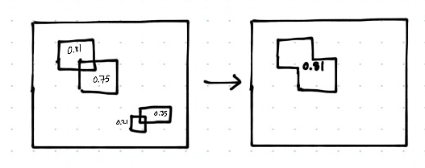

# R-CNN
These notes describe the R-CNN model for object detection. These are my notes from many online sources, referenced at the bottom. Thank you to their authors for their awesome explanations!

__Task__: Locate objects in an image (object detection)

__Approach__: Slide different sized rectangles across the region, and check each region for an object.
  * Problem: gives too many windows
  * Solution: Check only a good subset of the possible regions (proposals). Need a good algorithm to choose the region proposals.

## Region proposals
R-CNN is agnostic to the region proposal method; you can use any algorithm you like (one common algorithm is the selective search algorithm).

This creates 200 proposal regions; still a lot, but much smaller than the brute-force sliding window approach.

## CNN (AlexNet)
With the proposal regions, we represent them with a feature vector in smaller dimensional space using a CNN. The author uses AlexNet as the feature extractor, giving a 4096d vector.

To do this, the AlexNet was trained on a classification task. After training, they removed the last softmax layer, giving the 4096-dimensional layer.

#### Remember:
The proposal regions will be different shapes, many smaller. So we need to __resize__ every region proposal into a same-sized square before feeding into the CNN (AlexNet).

## SVM
Now we have regions as 4096-dimensional feature vectors, and we need to classify whether the region contains the object or not. For classification, we use SVMs. 

We use one SVM for each object class. That means we have n outputs (ranging from 0 to 1) for each region, where n is the number of possible objects we want to detect. The outputs represent our confidence that the image is present.

Note that we must get the feature vectors from the CNN (AlexNet) before training the SVMs. Then, we train the SVMs with the 4096-dim inputs as typical supervised learning.

## Bounding Boxes
The model also predicts four _offset_ values. These _offset values_ help re-center the bouding box (e.g. if the region contains a face, but the face has been but in half, then the offset values shift the region to capture more of the face).

## summary so far
1. Create image proposals
2. Create feature vector of each proposal using CNN
3. Classify each object-specific SVM

## Combine proposal regions
For each object class independently, combine regions that overlap and take the higher score of the two (or more) overlapping regions.

Then, keep only regions which have a score higher than 0.5.

## Final note
It was useful to pre-train the CNN using a large amount of data, then tune the network for the actual task (object detection).

# References
* [Part 1: R-CNN (Object Detection)](https://towardsdatascience.com/r-cnn-3a9beddfd55a)
* __R-CNN paper__: Rich feature hierarchies for accurate object detection and semantic segmentation ([https://arxiv.org/pdf/1311.2524.pdf](https://arxiv.org/pdf/1311.2524.pdf))
